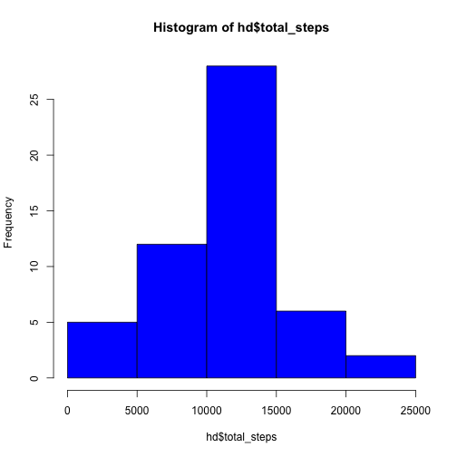
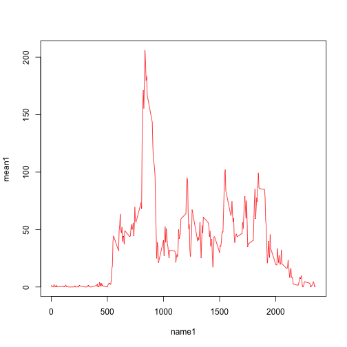
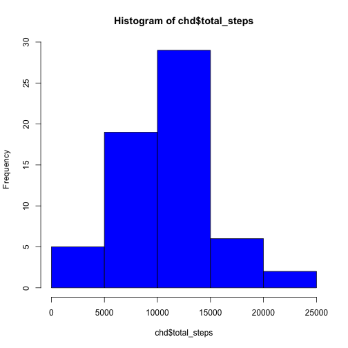
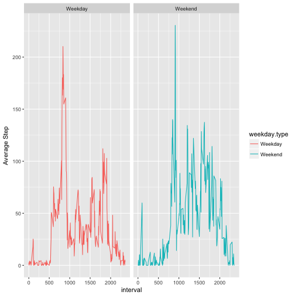

Peer-graded Assignment: Reproduciable Data Project 1
====================================================

Set working directory

```r
setwd("/Users/sagashin/Desktop/Coursera_R_DS/Reproduciable")
```

Code for reading in the dataset and/or processing the data

```r
df <- read.csv("activity.csv")
df$date <- as.Date(df$date)
df <- df[!is.na(df$steps),]
```

Histogram of the total number of steps taken each day

```r
library(ggplot2)
library(dplyr)
```

```
## 
## Attaching package: 'dplyr'
```

```
## The following objects are masked from 'package:stats':
## 
##     filter, lag
```

```
## The following objects are masked from 'package:base':
## 
##     intersect, setdiff, setequal, union
```

```r
hd <- df %>% 
        group_by(date) %>% 
        summarise(total_steps = sum(steps))

hist(hd$total_steps, col = "blue")
```



Mean and median number of steps taken each day

```r
smean <- mean(df$step, na.rm = TRUE)
smed <- median(df$step, na.rm = TRUE)
stats1 <- c(smean,smed)
names(stats1) <- c("mean","median")
stats1
```

```
##    mean  median 
## 37.3826  0.0000
```

Time series plot of the average number of steps taken

```r
mean1 <- tapply(df$step, as.factor(df$interval),mean)
name1 <- as.integer(names(mean1))
plot(name1,mean1,type="l", col = "red")
```


The 5-minute interval that, on average, contains the maximum number of steps

```r
df2 <- as.data.frame(mean1)
max <- max(df2$mean1)
df2[df2$mean1 == max,]
```

```
##      835 
## 206.1698
```
Code to describe and show a strategy for imputing missing data use mice package to impute

```r
library(mice)
```
read csv

```r
df3 <- read.csv("activity.csv")
```
impute date

```r
imp <- mice(df3)
```

```
## 
##  iter imp variable
##   1   1  steps
##   1   2  steps
##   1   3  steps
##   1   4  steps
##   1   5  steps
##   2   1  steps
##   2   2  steps
##   2   3  steps
##   2   4  steps
##   2   5  steps
##   3   1  steps
##   3   2  steps
##   3   3  steps
##   3   4  steps
##   3   5  steps
##   4   1  steps
##   4   2  steps
##   4   3  steps
##   4   4  steps
##   4   5  steps
##   5   1  steps
##   5   2  steps
##   5   3  steps
##   5   4  steps
##   5   5  steps
```
complete dataset with imputed values

```r
comp <- complete(imp,2)
```
Histogram of the total number of steps taken each day after missing values are imputed

```r
chd <- comp %>% 
        group_by(date) %>% 
        summarise(total_steps = sum(steps))

hist(chd$total_steps, col = "blue")
```



```r
cmean <- mean(comp$step, na.rm = TRUE)
cmed <- median(comp$step, na.rm = TRUE)
stats2 <- c(cmean,cmed)
names(stats2) <- c("mean","median")
```
mean and median for imputed dataset

```r
stats2
```

```
##     mean   median 
## 36.19871  0.00000
```
mean and median for non-imputed dataset

```r
stats1
```

```
##    mean  median 
## 37.3826  0.0000
```
Panel plot comparing the average number of steps taken per 5-minute interval across weekdays and weekends

```r
comp$date <- as.Date(comp$date)
wkd <- weekdays(comp$date) != c("土曜日","日曜日")
wke <- weekdays(comp$date) == c("土曜日","日曜日")
```
add a new column containing day of week

```r
comp$weekday = weekdays(comp$date)
```
add a new column containing either Weekday OR Weekend

```r
comp$weekday.type <- ifelse(comp$weekday == "土曜日" | comp$weekday == 
                                       "日曜日", "Weekend", "Weekday")
```
convert column to factor

```r
comp$weekday.type <- factor(comp$weekday.type)
```
Calculate mean steps by weekdays and weekend

```r
library(ggplot2)
library(dplyr)
sd <- comp %>% 
        group_by(interval,weekday.type) %>% 
        summarise(ms = mean(steps))
qplot(interval,ms,data = sd, facets = . ~ weekday.type, geom = "line", color = weekday.type,
      ylab = "Average Step")
```



All of the R code needed to reproduce the results (numbers, plots, etc.) in the report
